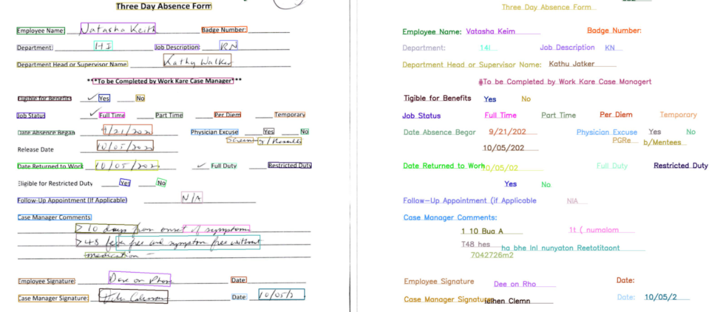
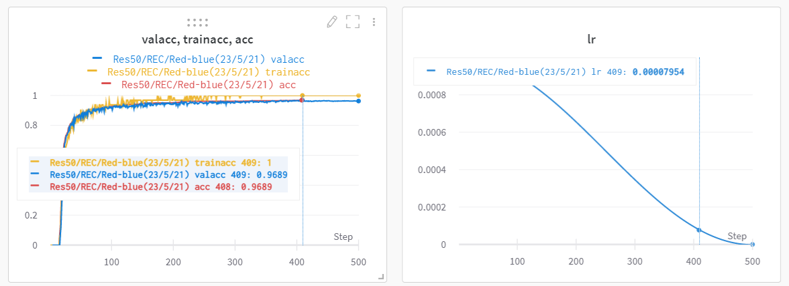

<button class="button is-primary is-rounded is-medium is-hovered is-static">
        DỰ ÁN
</button>

---

 

   

    
      <i class="fas fa-check-circle"></i>
    
    <strong>Nhận diện kí tự quang học</strong>
   

  

 

 

  <article class="message is-success">
    

      

        
Huấn luyện mô hình nhận diện kí tự quang học để trích xuất chữ từ website, tài liệu scan hoặc tài liệu viết tay

        
Xem thêm chi tiết của việc huấn luyện <a href="https://wandb.ai/phattruong2709/Paddle-OCR/runs/117zodm2/overview" title="dashboard">tại đây</a>

      

    

  </article>
 

 

 

  

    <figure class="image is-2by1">
      
    </figure>
    <figure class="image is-3by1">
      
    </figure>
  

 

  

  
  

---

 

   

    
      <i class="fas fa-check-circle"></i>
    
    <b>Theo dấu nhiều người qua nhiều camera</b>
   

  

 

 

  <article class="message is-success">
    

      

        
Thực hiện thuật toán theo dấu nhiều người thông qua tầm nhìn từ nhiều camera dựa vào <b>Mô hình tái xác minh người</b>

      

    

  </article>
 

 

 

  

  
  

 

  

  
  

---

 

   

    
      <i class="fas fa-check-circle"></i>
    
    <b>Phát hiện phạm tội đang xảy ra</b>
   

  

 

 

  <article class="message is-success">
    

      

        
Thực hiện thuật toán phát hiện nhiều yếu tố tội phạm để xác định rằng liệu đang có một quá trình phạm pháp xảy ra hay không, tiếp tục xác định thủ phạm nếu được

      

    

  </article>
 

 

 

  

  
  

 

  

  
  

---

 

   

    
      <i class="fas fa-check-circle"></i>
    
    <b>Phát hiện thủ phạm và theo dõi qua nhiều camera</b>
   

  

 

 

  <article class="message is-success">
    

      

        
Đây là sự kết hợp của <b>Theo dấu nhiều người qua nhiều camera</b> và <b>Phát hiện phạm tội đang xảy ra</b>, sau khi phát hiện thủ phạm, hệ thống sẽ ngay lập tức theo dấu đối tượng qua nhiều camera, đặc biệt các camera không cần phải có góc nhìn giao nhau

      

    

  </article>
 

 

 

  

  
  

 

---

 

   

    
      <i class="fas fa-check-circle"></i>
    
    <b>Phát hiện khẩu trang</b>
   

  

 

 

  <article class="message is-success">
    

      

        
Phát hiện rằng một người có đang đeo khẩu trang hay không, giúp cảnh báo mọi người một cách tự động trong tình hình dịch Covid 19 đang lan rộng

      

    

  </article>
 

 

 

  

  
  

 

  

  
  

---

 

   

    
      <i class="fas fa-check-circle"></i>
    
    <b>Truy vết sự tiếp xúc thông qua camera</b>
   

  

 

 

  <article class="message is-success">
    

      

        
Phát hiện người có đeo khẩu trang hay không đồng thời đo khoảng cách giữa mọi người với nhau, góp phần truy vết dễ dàng sau này

      

    

  </article>
 

 

 

  

  
  

 

  

  
  

---



<!-- 

 

   

    
      <i class="fas fa-check-circle"></i>
    
    <b>Graduation Project: Tomato classification system</b>
   

  

 

  
Lorem ipsum

 

 

   

    
      <i class="fas fa-check-circle"></i>
    
    <b>ABU Robocon 2018: Robot throw the shuttlecock</b>
   

   

 

  
Lorem ipsum

 

 

   

    
      <i class="fas fa-check-circle"></i>
    
    <b>ABU Robocon 2017: Robot throwing the flying discs</b>
   

  

 

  
Lorem ipsum

 

 -->

